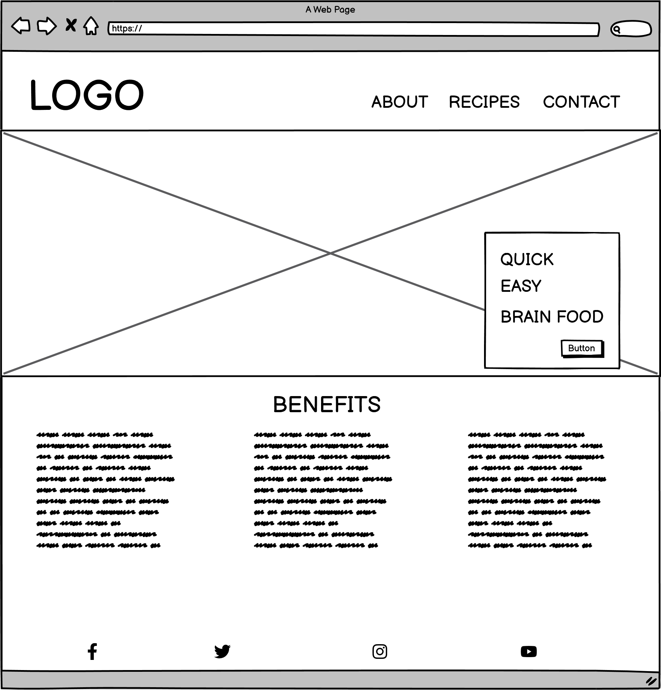
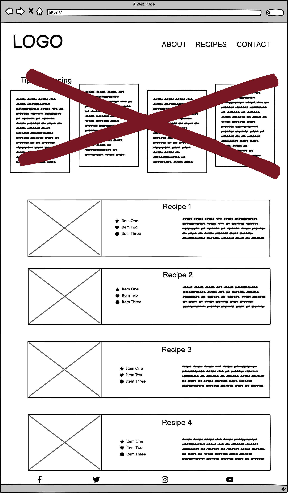
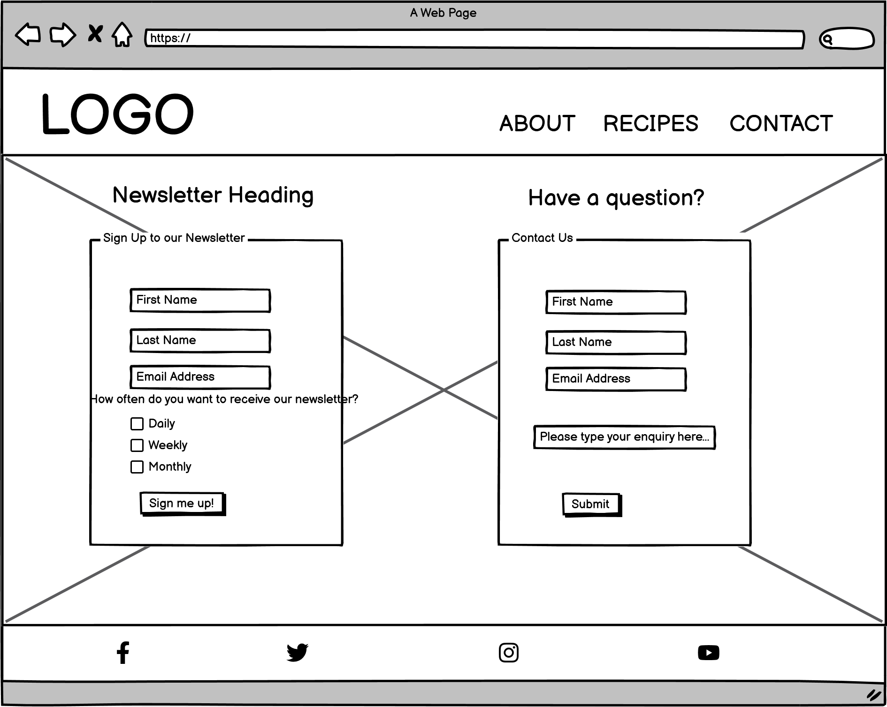
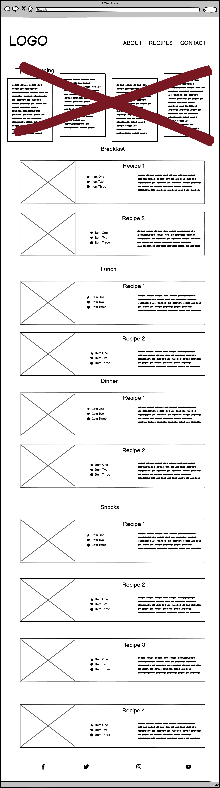
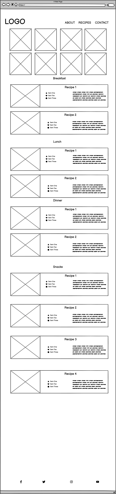
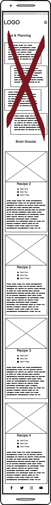
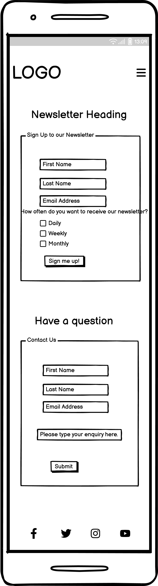

# Clean Crave

Clean Crave is a site to provide healthy meals that aid people whilst studying. The site is targeted at students who want to know what foods are good for brain function and concentrating. The site will be useful to help take away the stress of thinking what to prepare on a daily basis.

Welcome to <a href="https://bpstephanie.github.io/Clean_Crave/index.html" target="_blank">Clean Crave</a>

## Wireframes

The wireframes for Clean Crave were produced in <a href="https://balsamiq.com/?gad_source=1&gclid=CjwKCAjw5v2wBhBrEiwAXDDoJSMse7lgXFB9cNqU7zcdlO_VQcy3jXX1J7YQbar6kNPPKscVweNuhBoCV7MQAvD_BwE">Balsamiq</a>. There a wireframes for full desktop and mobile sizes. There are 2 alternate versions of the desktop Recipes page. 

Desktop wireframes:

Alternate Recipes page wireframes:

Mobile wireframes:

## Features 

### Existing Features

- __Navigation Bar__

  - Featured on all three pages, the full responsive navigation bar includes links to the Logo, Home page, Recipes page and Contact page and is identical in each page to allow for easy navigation.
  - On mobile devices, access to the Home page, Recipes page and Contact page is from the dropdown menu by clicking the burger icon.
  - This section will allow the user to easily navigate from page to page across all devices without having to use the ‘back’ button. 

- __The landing page image__

  - The landing includes a photograph which changes depending on the size of the screen you are accessing the site on. Each have a text overlay with the premise of the site and a call-to-action button that leads them directly to the recipes page. 
  - This section introduces the user to Love Running with an eye catching animation to grab their attention

- __Benefits section__

  - The Benefits section will allow the user to see the reasons why eating well helps them with their studies.
  - Below the reasons why, the user will see images of some of the best foods for brain function. This is valuable to the user to have visual representation of some of the foods in the recipes. 

![Club Ethos]

- __The Footer__ 

  - The footer section includes links to the relevant social media sites for Clean Crave. The links will open to a new tab to allow easy navigation for the user. 
  - The footer is valuable to the user as it encourages them to keep connected via social media.

![Footer]

- __The Recipes page__

  - The recipes page will provide the user with recipes for breakfast, lunch, dinner and snacks. 
  - This section is valuable to the user as...... 

![Gallery]

- __The Contact Page__

  - This page will allow the user to subscribe to a daily/weekly or monthly newsletter, depending on their preference, where they will be kept up to date with the newest recipes, tips and advice to staying on the healthy track. The user will be asked to submit their full name and email address. 
  - This page will also allow users to get in contact with Clean Crave. The user will be asked to submit their full name and email address, along with their enquiry.

  __The Submitted Enquiry age / The Newsletter page__
  
  - These pages acknowledge the user has submitted an enquiry and signed up to a newsletter subscription. They thank the user and have a button to return to the home page and recipes page, respectively.

![Sign Up]

### Features Left to Implement

- Another feature idea

## Testing 

First testing on HTML W3C validator:

Home page 

1. Removed the <a> tag from the button, added a form tag.
2. Corrected <p1> to 

3. Changed id=”benefits-point” to a class.
4. Same as point 3
5. Same as point 2
6. Same as point 3
7. Same as point 3
8. Same as point 2

Recipes page

1. Added alt and aria-label attributes to image
2. Removed <p1> tag
3. Same as point 1
4. Same as point 2
5. Same as point 1
6. Removed </p1> tag

Contact page

1. Changed id=”first-name” to “first-name-N” for the Newsletter form.
2. Changed id=”first-name” to “first-name-E” for the Enquiry form.
3. Changed id=”last-name” to “last-name-N” for the Newsletter form.
4. Changed id=”last-name” to “last-name-E” for the Enquiry form.
5. Changed id=”email-address” to “email-address-N” for the Newsletter form.
6. Changed id=”email-address” to “email-address-E” for the Enquiry form.
7. Changed rows=”auto” to rows=”10”
8. Changed cols=”auto” to cols=”20”

### Validator Testing 

- HTML
  - No errors were returned when passing through the official [W3C validator](https://validator.w3.org/nu/?doc=https%3A%2F%2Fcode-institute-org.github.io%2Flove-running-2.0%2Findex.html)
- CSS
  - No errors were found when passing through the official [(Jigsaw) validator](https://jigsaw.w3.org/css-validator/validator?uri=https%3A%2F%2Fvalidator.w3.org%2Fnu%2F%3Fdoc%3Dhttps%253A%252F%252Fcode-institute-org.github.io%252Flove-running-2.0%252Findex.html&profile=css3svg&usermedium=all&warning=1&vextwarning=&lang=en#css)

### Unfixed Bugs

## Deployment

This section should describe the process you went through to deploy the project to a hosting platform (e.g. GitHub) 

- The site was deployed to GitHub pages. The steps to deploy are as follows: 
  - In the GitHub repository, navigate to the Settings tab 
  - From the source section drop-down menu, select the Master Branch
  - Once the master branch has been selected, the page will be automatically refreshed with a detailed ribbon display to indicate the successful deployment. 

The live link can be found here - https://code-institute-org.github.io/love-running-2.0/index.html 

## Credits 

### Content 

- The text for the Home page was taken from Wikipedia Article A
- Instructions on how to implement form validation on the Sign Up page was taken from [Specific YouTube Tutorial](https://www.youtube.com/)
- The icons in the footer were taken from [Font Awesome](https://fontawesome.com/)

### Media

- The photos used..
