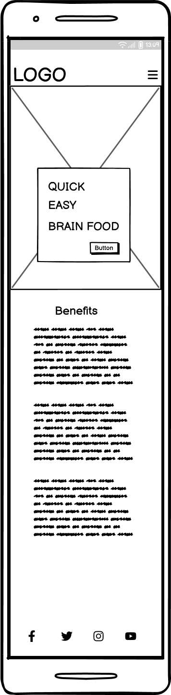

# Clean Crave

Clean Crave is a site to provide healthy meals that aid people whilst studying. The site is targeted at students who want to know what foods are good for brain function and concentrating. The site will be useful to help take away the stress of thinking what to prepare on a daily basis.

Welcome to <a href="https://bpstephanie.github.io/Clean_Crave/index.html">Clean Crave</a>

# Contents

* [**User Experience UX**](<#user-experience-ux>)
    * [Wireframes](<#wireframes>)
    * [Site Structure](<#site-structure>)
    * [Design Choices](<#design-choices>)
    *  [Typography](<#typography>)
    *  [Colour Scheme](<#colour-scheme>)
* [**Features**](<#features>)
    * [**Existing Features](<#existing-features>)
      * [**Home**](<#navigation-bar>)
          * [Navigation bar](<#navigation-bar>)
          * [Landing Page Image](<#landing-page-image>)
          * [The Benefits Section](<#the-benefits-section>)
          * [The Benefits Section Gallery/ Brain Food Gallery](<#the-benefits-section-gallery--brain-food-gallery>)
          * [Footer](<#footer>)
      * [**The Recipes Page**](<#the-recipes-page>)
      * [**The Contact Page**](<#the-contact-page>)
      * [**Contact**](<#the-contact-page>)
      * [**The Newsletter Page**](<#the-newsletter-page>)
      * [**The Submitted Enquiry Page**](<#the-submitted-enquiry-page>)
  * [**Future Features**](<#future-features>)
* [**Technologies Used**](<#technologies-used>)
* [**Testing**](<#testing>)
* [**Deployment**](<#deployment>)
  * [**To Deploy the Project**](<#to-deploy-the-project>)
  * [**To Fork the Project**](<#to-fork-the-project>)
  * [**To Clone the Project**](<#to-clone-the-project>)
* [**Credits**](<#credits>)
    * [**Content**](<#content>)
    * [**Media**](<#media>)
*  [**Acknowledgements**](<#acknowledgements>)

## Wireframes

The wireframes for Clean Crave were produced in [Balsamiq](https://balsamiq.com). There a wireframes for desktop and mobile sizes. There are 2 alternate versions of the desktop Recipes page. 

Desktop wireframes:

Alternate Recipes page wireframes:

Mobile wireframes:

## Site Structure

Clean Crave website has three pages. The [home page](index.html) is the default landing page, [recipes page](recipes.html) and [contact page](contact.html) are accessible through the navigation menu. There is another link to the recipes page through the call-to-action button on the landing page image. This is for users who want to go straight to the recipes section.

## Design Choices

  - ### Typography 
    The fonts chosen were 'Merienda' for the main headings and 'Lato' for the text in the body. Their fall back fonts are cursive and sans-serif, respectively.
      * 'Merienda' was chosen for the headings to create an eye-catching title.
      * 'Lato' was chosen for its easy to read properties.
  
  - ### Colour Scheme
    The colour scheme chosen was green, beige and coral. Green was chosen for its healthy conotations. Clean Crave wants its users to know that the knowledge and recipes on the site are good for the users' wellbeing and health.

## Features 

Clean Crave site is set up to be easy to use and friendly. It contains features that the user will be familiar with, such as a navigation bar, burger icon with dropdown menu, contact forms and social media icons in the footer.

## Existing Features

- ### Navigation Bar

  - Featured on all three pages, the fully responsive navigation bar includes links to the Logo, Home page, Recipes page and Contact page and is identical on each page to allow for easy navigation.
  - On mobile devices, access to the Home page, Recipes page and Contact page is from the dropdown menu by clicking the burger icon.
  - This section will allow the user to easily navigate from page to page across all devices without having to use the ‘back’ button. 

Desktop navigation menu:

Mobile navigation menu:

- ### The Landing Page Image

  - The landing page includes a photograph which changes depending on the size of the screen you are accessing the site on. Each have a text overlay with the premise of the site and a call-to-action button that leads them directly to the recipes page. 
  - This section introduces the user to Clean Crave with an image of people cooking healthy food to grab the user's attention.

- ### The Benefits Section

  - The Benefits section is located below the landing page image. It will allow the user to see the reasons why eating well helps them with their studies. It is intended to compel the user to want to see the recipes available. It is also to give more insight into why what we eat is important and how it affects the user.

- ### The Benefits Section Gallery / Brain Food Gallery
  - Below the benefits section, the gallery is located. These images show some of the best foods for  brain function. They each have a text overlay stating what they are. This gallery is valuable to users who are visual learners. 
  - The images and text overlay are responsively styled for different screen sizes.

- ### The Footer

  - The footer section includes links to the relevant social media sites for Clean Crave. The links will open to a new tab to allow easy navigation for the user. 
  - The footer is valuable to the user as it encourages them to keep connected via social media.

- ### The Recipes Page

  - The recipes page will provide the user with recipes for breakfast, lunch and dinner. 
  - Each recipe has an image to give the user a visual representation of what the recipe makes.
  - This section would be updated regularly to add more recipes.
  - This page is responsive to different screen sizes.
  

- ### The Contact Page

  - This page will allow the user to subscribe to a daily, weekly or monthly newsletter, depending on their preference. The newletter will be kept up to date with the newest recipes, tips and advice to staying on the healthy track. The user will be asked to submit their full name and email address. 
  - This page will also allow users to get in contact with Clean Crave. The user will be asked to submit their full name and email address, along with their enquiry.
  - This page is responsive to different screen sizes.

 

  - ### The Newsletter Page

   - This page acknowledges the user has subscribed to the newsletter. For this project it validates the form only.
  - It provides a link back to the recipes page as well as having the navigation menu and social media links in the footer.

-  ### The Submitted Enquiry Page
  
  - This page acknowledges the user has submitted an enquiry. For this project it validates the form only.
  - It provides a link back to the home page as well as having the navigation menu and social media links in the footer.

### Future Features

- Print buttons for the recipe cards.
- A filter system for users to choose recipes with key ingredients.
- A gallery with all the recipe images and links for users to choose by looking rather than by reading.
- A share button for users to share recipes with friends.
- A tips and planning section to help users stay on track.
- A rating and comments section on each recipe for users to give opinions and interact.

## Technologies Used
* [HTML5](https://html.spec.whatwg.org/) - provides the content and structure for the website.
* [CSS](https://www.w3.org/Style/CSS/Overview.en.html) - provides the styling.
* [Balsamiq](https://balsamiq.com/wireframes/) - used to create the wireframes.
* [Gitpod](https://www.gitpod.io/#get-started) - used to deploy the website.
* [Github](https://github.com/) - used to host and edit the website.

## Testing 

Please refer [**_here_**](TESTING.md) for more information about testing on Clean Crave.

## Deployment

### **To Deploy the Project**

This site was deployed to GitHub pages. The steps to deploy are as follows:

  1. In the GitHub repository, navigate to the Settings tab. 
  2. Next, navigate to the Pages tab on the left hand side.
  3. Under Source, select main from the Branch dropdown menu. Then click save.
  4. Once the main branch has been selected, the page will automatically be refreshed with a detailed ribbon display to indicate the successful deployment. 

The live link can be found here - https://bpstephanie.github.io/Clean_Crave/recipes.html

### **To Fork the Project**

A copy of the GitHub Repository can be made by forking the GitHub account. This copy can be viewed and changes can be made to the copy without affecting the original repository. The steps to fork the repository are as follows:

  1. Log in to GitHub and locate the repository.
  2. On the right hand side of the page, inline with the repository name, is a button called 'Fork', click on the button to create a copy of the original repository in your GitHub Account.
  

### **To Clone the Project**

The steps to clone a project from GitHub are as follows:

  1. Under the repository’s name, click on the code tab.
  2. Copy the URL under the Clone with HTTPS section.
  3. In an IDE of your choice, open Git Bash.
  4. Change the current working directory to the location of where the cloned directory will be made.
  5. Type 'git clone' then paste the URL copied from GitHub.
  6. Upon pressing enter, the local clone will be created.

## Credits 

* Wireframes: [Balsamiq](https://balsamiq.com)
* Favicon: [Favicon](https://favicon.io/)
* Fonts: [Google Fonts](https://fonts.google.com/)
* Icons: [Fontawesome](https://fontawesome.com/)
* Colour Palettes: [Coolors](https://www.bbcgoodfood.com/)
* Mockup: [Techsini](https://techsini.com/)
* Chrome for Developers: [Dev Tools](https://developer.chrome.com/docs/devtools)

* The polka-dot background was learned from [30 Seconds of Code](https://www.30secondsofcode.org/css/s/polka-dot-pattern/). 

* Instructions on how to implement the text overlay on the brain food gallery was taken from [Banner Bear](https://www.bannerbear.com/blog/)

* Help with flexbox came from [CSS Tricks](https://css-tricks.com/)

* Help with troubleshooting came from [Stack Overflow](https://stackoverflow.com/)

### Content

The information on the home page is from [Nottingham.ac.uk](https://www.nottingham.ac.uk/currentstudents/wellbeing/healthyu/index.aspx) and [Sleep Foundation](https://www.sleepfoundation.org/nutrition).

The recipes on the recipes page are from [BBC Good Food](https://www.bbcgoodfood.com/) and [Eating Well](https://www.eatingwell.com/)

### Media

The images are from [Pexels](https://www.pexels.com/), [Pixabay](https://pixabay.com/) and [BBC Good Food](https://www.bbcgoodfood.com/).

The images were optimised with [Tinypng](https://tinypng.com/).

## Acknowledgements

Clean Crave has been completed as a Portfolio 1 Project, part of the Full Stack Software Developer Diploma at Code Institute. I would like to thank my Code Institue mentor,  Precious Ijege, the Slack community, and everyone at Code Institute for their help and support. 

Stephanie Bell 2024.
